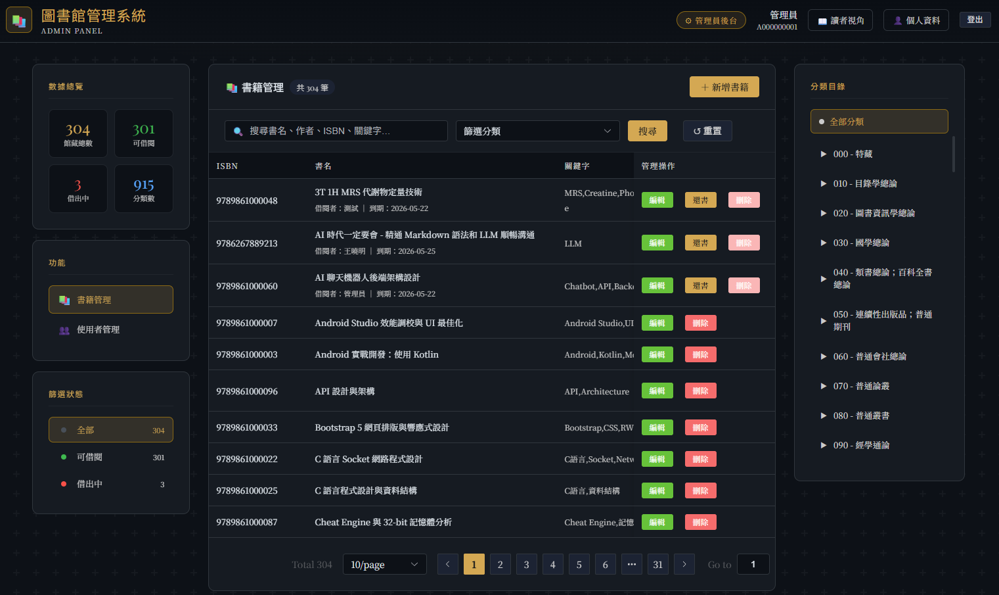
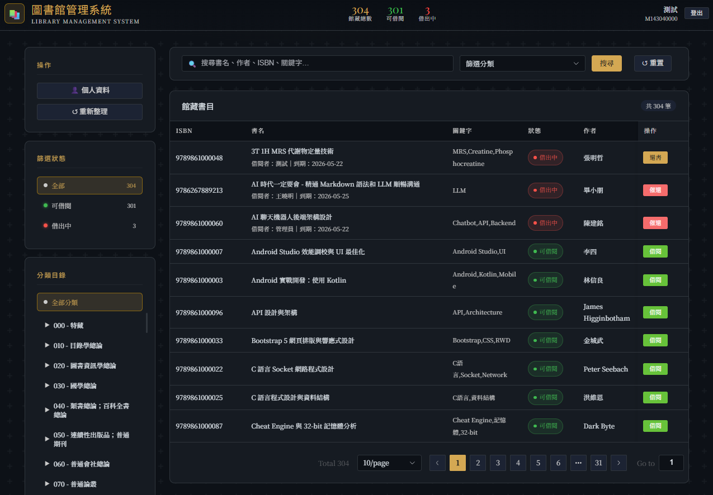

# 圖書館管理系統技術文件與使用指南
## 系統預覽

| 管理員後台 | 讀者借閱介面 |
|:---:|:---:|
|  |  |

## 1. 系統概述與技術堆疊

本系統為基於主從式架構 (Client-Server Architecture) 的圖書館管理系統。系統設計著重於權限隔離、資料完整性與自動化通知機制。

* **前端架構:** HTML5, CSS3, Vue.js 3 (CDN), Element Plus (CDN)
* **後端架構:** PHP 8+ 原生架構 (核心防護與 Session 會話管理)
* **資料庫:** MySQL / MariaDB (透過 PDO 連線技術防止 SQL 注入)
* **依賴管理:** Composer 套件管理器
* **郵件元件:** PHPMailer (v6.12.0) 整合 SMTP 協定

---

## 2. 開發環境與建置步驟

### 系統需求
* XAMPP (整合 Apache 網頁伺服器與 MySQL 資料庫)
* Composer 依賴管理工具 (Windows 環境請使用 Composer-Setup.exe)

### 部署流程

* ### 步驟一：部署原始碼
    將專案資料夾命名為 `dbs_lab_library`，並放置於網頁根目錄：
    * 預設路徑：`C:\\xampp\\htdocs\\dbs_lab_library`

* ### 步驟二：安裝後端依賴
    開啟命令提示字元或終端機，切換至專案根目錄並執行安裝指令以生成 `vendor` 自動載入目錄：

    ```bash
    cd C:\\xampp\\htdocs\\dbs_lab_library
    composer install
    ```

* ### 步驟三：資料庫建置

    1. 啟動 XAMPP 的 Apache 與 MySQL 模組。
    2. 存取 phpMyAdmin 管理介面：`http://localhost/phpmyadmin/`
    3. 建立名為 `dbs_lab_library` 的資料庫，語系編碼設定為 `utf8mb4_general_ci`。
    4. 將專案根目錄下的 `dbs_lab_library.sql` 檔案匯入該資料庫。

* ### 步驟四：環境變數與資安設定

    1. **資料庫連線:** 編輯 `config.php`，修正 `DB_HOST`, `DB_NAME`, `DB_USER`, `DB_PASS` 等資料庫連線參數（可搜尋 `// TODO` 標籤）。
    2. **SMTP 郵件設定:** 將 `mail_config_example.php` 重新命名為 `mail_config.php`，並填入有效的 SMTP 伺服器資訊（如 Gmail 帳號與應用程式 16 位數密碼）。

---

## 3. 系統存取入口與測試帳號

* **系統登入入口:** `http://localhost/dbs_lab_library/login.php`
* **資料庫管理:** `http://localhost/phpmyadmin/index.php?route=/database/structure&db=dbs_lab_library`

### 預設測試帳號

* **管理員 (Admin) 權限**
    * 帳號：`A000000001`
    * 密碼：`admin1234`


* **一般讀者 (Student) 權限**
    * 帳號：`M143040000`
    * 密碼：`123456`


> **資安安全性提示:** 密碼儲存採用 PHP 內建 `password_hash()` (Bcrypt 演算法)。API 端點皆通過 `auth.php` 進行會話攔截，越權存取將返回 401 Unauthorized 或 403 Forbidden 錯誤碼。

---

## 4. 資料庫結構說明

### 核心資料表

| 資料表 | 主鍵 | 說明 |
|---|---|---|
| `user` | `user_id` (學號 10 碼) | 帳號資料，含姓名、Email、Bcrypt 密碼、role（admin/student） |
| `book` | `book_id` (ISBN-13 碼) | 館藏書目，含書名、作者、分類代碼、借閱狀態（0=可借/1=借出）、關鍵字 |
| `category` | `category_id` (中文圖書分類法 3 碼) | 書籍分類對照表，提供書目分類名稱 |
| `borrow` | `borrow_id` (UUID 32 碼) | 借閱紀錄，含借閱者、書籍、借書日、到期日、還書日（NULL 代表尚未歸還） |
| `notification` | `notification_id` (UUID 32 碼) | 站內通知紀錄，含收件人、通知類型、訊息內容、建立時間 |
| `notification_type` | `type_id` (UUID 32 碼) | 通知類型對照表（催還通知、新書通知、註冊通知、系統通知） |

### 外鍵關聯

```
user <── borrow ──> book

book ──> category

user <── notification <─── notification_type
```

| 外鍵 | 來源資料表 | 參照資料表 |
|---|---|---|
| `book.category_id` | `book` | `category.category_id` |
| `borrow.user_id` | `borrow` | `user.user_id` |
| `borrow.book_id` | `borrow` | `book.book_id` |
| `notification.user_id` | `notification` | `user.user_id` |
| `notification.type_id` | `notification` | `notification_type.type_id` |

> 完整結構可匯入 `dbs_lab_library.sql` 後，於 phpMyAdmin 的「Designer」頁籤視覺化檢視。


---

## 5. 書籍管理與動態儀表板

### 數據總覽與即時統計

系統主介面內嵌數據儀表板功能。系統初始化或重置篩選時，前端 Vue 應用程式會調用 `fetchStats()` 函式向後端獲取完整書目，並動態即時計算「館藏總數」、「可借閱總數」與「借出中總數」，提供視覺化的數據監控。

### 書籍查詢、篩選與分頁

* **多條件模糊查詢:** 支援書名、作者、ISBN 或關鍵字。前端將參數封裝為查詢字串提交至 `get_books.php`，後端透過 SQL `LIKE` 語法進行多欄位模糊比對。
* **狀態與分類過濾:** 側邊欄提供動態分類目錄（點擊 0 結尾的大分類可展開子分類）及借閱狀態篩選器。
* **分頁機制:** 為了優化大量資料的渲染效能，前端實作了資料分頁組件（Pagination），依據當前頁碼與每頁筆數（預設 10 筆）動態切割資料流，降低客戶端瀏覽器 DOM 樹的負載。

### 書籍維護作業（管理員專屬）

* **書籍新增:** 由 `add_book.php` 處理。管理員須輸入 13 位數 ISBN、書名、作者並選擇分類。後端會執行嚴格的欄位校驗與 ISBN 唯一性檢查。
* **書籍編輯:** 由 `update_book.php` 處理。系統允許修改書名、作者、分類與關鍵字。為維護資料庫參照完整性，作為主鍵的 ISBN 欄位在介面上會強制設為禁用狀態，不允許修改。
* **書籍刪除:** 由 `delete_book.php` 處理。若書籍狀態為借出中（狀態碼 1），刪除按鈕會自動禁用。可刪除時，系統會開啟資料庫交易，同步抹除 `borrow` 表中的歷史借閱紀錄，隨後自 `book` 表移除書籍。

---

## 6. 借還書業務邏輯

### 借書登記

1. 當書籍狀態為「可借閱」（狀態碼 0）時，讀者可發起借閱請求。
2. 透過前端表單可調整借閱天數（預設 14 天，允許範圍 1 至 90 天），系統會即時動態計算出到期日期。
3. 請求提交至 `borrow_book.php`，後端強制從伺服器 Session 中提取當前登入者的 `user_id`，防止前端惡意篡改身分。
4. 系統自動生成 32 碼無連字符的 UUID 作為 `borrow_id`，向 `borrow` 表寫入紀錄，並將書籍狀態變更為 1（借出中）。

### 還書登記

* **一般學生:** 僅能經由讀者首頁歸還自身借閱的書籍。後端 `return_book.php` 會比對當前尚未歸還紀錄中的 `user_id` 是否與當前會話一致，不符則拒絕請求。
* **管理員:** 具備高階核心權限，得在管理後台直接代任何讀者執行歸還結案手續，跳過身分一致性檢查。
* 還書確認後，系統將 `return_date` 更新為當前系統日期，並將書籍狀態回滾為 0（可借閱）。

---

## 7. 自動化通知與站內紀錄持久化

### 自動催還通知 (Email Recalling)

1. 當讀者欲借閱的書籍處於「借出中」狀態時，可點擊「催還」按鈕向 `notify_return.php` 發送 POST 請求。
2. 後端利用關聯查詢（JOIN）精確鎖定目前佔有該書籍的借閱者，獲取其姓名與 Email。
3. 調用 `mailer.php` 模組，透過 SMTP 發送富文字 (HTML) 催還通知郵件。
4. **通知紀錄持久化:** 郵件發送成功後，系統會調用 `saveNotificationToDB()` 函數，在資料庫 `notification` 表中即時寫入一筆催還通知紀錄。這確保了借閱者不論是查看信箱，或是登入系統內台，皆能同步讀取催還訊息。

### 新書廣播通知 (New Book Notification)

1. 管理員於後台成功新增書籍並寫入資料庫後，背景會自動觸發廣播程序（`add_book.php`）。
2. 後端主動向 `user` 表檢索所有角色為學生（`role = 'student'`）的用戶，並自動排除管理員。
3. 系統以非同步迴圈方式走訪學生名單，呼叫 PHPMailer 向所有學生派送新書宣傳郵件。
4. 每成功寄出一封郵件，底層便會同步將事件持久化寫入 `notification` 資料表，留存完整的審計軌跡。

---

## 8. 帳號、權限與安全管理

### 讀者註冊與身份驗證

* **註冊驗證碼:** 透過 `send_verification.php` 接收 Email，檢查未被註冊後，生成 6 位數隨機驗證碼與 5 分鐘過期時效並寫入伺服器 Session，隨後寄送驗證信。
* **帳號註冊實作:** 讀者提交資料至 `register.php`。後端會校驗學號是否精確符合 10 碼、比對驗證碼正確性與時效。通過後，使用 `password_hash()` 配合 Bcrypt 演算法將密碼進行非對稱雜湊加密，啟動資料庫交易寫入 `user` 表並新增註冊通知。

### 認證與安全退出機制

* **安全登入 (login.php):** 系統採用密碼雙重比對機制，首先進行傳統字串比對（相容手動建置的明碼測試帳號），不符合則改以 `password_verify()` 比對 Bcrypt 雜湊值。認證成功後，立即執行 `session_regenerate_id(true)` 銷毀並重構會話 ID，全面阻斷會話固定 (Session Fixation) 漏洞攻擊。
* **登出銷毀 (logout.php):** 調用 `session_unset()` 與 `session_destroy()` 徹底終止伺服器會話紀錄。同時，後端會主動向客戶端瀏覽器發送過期時間設定，強制清除客戶端的 Session Cookie。

### 個人資料自主管理

* **姓名修改 (`update_profile.php`):** 僅限修改自身帳號姓名，限制長度為 10 個字元，變更後同步刷新 `$_SESSION['name']` 變數。
* **密碼變更 (`update_password.php`):** 變更時必須輸入原密碼進行 Bcrypt 安全校驗，且新密碼長度必須大於或等於 6 個字元。
* **電子郵件變更:** 採兩階段驗證。第一階段 (`send_email_verify.php`) 排除自身學號執行防撞檢查，寄出 6 位數驗證碼並暫存於 Session；第二階段 (`update_email.php`) 驗證碼確認無誤後，執行防搶注檢查，最後更新資料庫與會話變數。

### 管理員高階帳號控制

* **使用者審查 (`admin_get_users.php`):** 管理員可透過多欄位 `LIKE` 語法進行讀者模糊搜尋，系統會透過 `LEFT JOIN` 自動統計每位讀者當前借閱中的書籍數量。
* **強制密碼重置 (`admin_reset_password.php`):** 當讀者忘記密碼時，管理員可在後台執行強制重置。系統設有核心自我保護邏輯，禁止管理員重置自身密碼以防權限鎖死。重置時，密碼將強制設定為該讀者的「學號」並進行 Bcrypt 加密，同時自動發送安全性通知郵件並持久化寫入系統通知紀錄。

---

## 9. 前端介面優化與跨裝置支援 (RWD)

系統前端介面具備軟體工程級的自適應優化與跨裝置支援能力。

* **單欄垂直排版佈局:** 透過 CSS 的 `@media (max-width: 1024px)` 媒體查詢技術，當讀者使用智慧型手機或平板電腦瀏覽時，系統會自動解除雙欄式 (Sidebar + Content) 的 Grid 硬性寬度限制，改為單欄垂直排列，並利用 `order: -1` 將核心的書目表格優先置頂，大幅提升行動端的隱性操縱體驗。
* **大型表格流體捲軸:** 針對 Element Plus 渲染的大型多列資料表格，系統在行動端會強制啟用橫向滾動隔離機制（`overflow-x: auto`），允許用戶透過手指左右滑動檢視 ISBN 與管理操作面板，完美防止資料結構擠壓或超出外層卡片容器。

---

## 10. 已知問題與未來規劃

### 已知限制
- 目前僅支援單一 SMTP 帳號發信，高併發時可能觸發 Gmail 頻率限制
- 管理員帳號目前僅能透過直接修改資料庫新增，尚無後台 UI 建立入口
- 無圖書封面上傳功能，書目顯示依賴純文字欄位

### Roadmap
- [ ] 借閱逾期自動標記與罰款計算模組
- [ ] 書籍封面圖片上傳與 CDN 整合
- [ ] RESTful API 改造，前後端完全分離
- [ ] 管理員多帳號建立介面

---

## 11. 授權聲明

本專案為學術課程作業用途，採用 [MIT License](https://opensource.org/licenses/MIT) 授權。  
使用、修改或散布前請保留原始版權聲明。

```
MIT License
Copyright (c) 2026 蔡岳哲
```